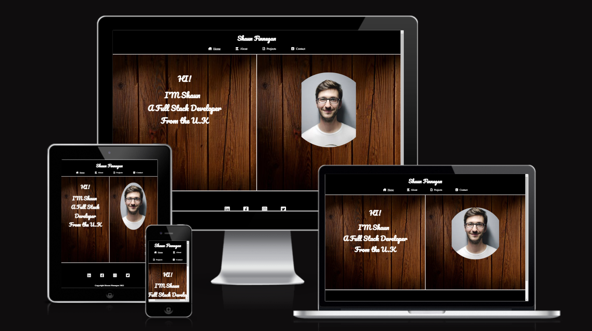

# Shaun Finnegan Full Stack Software Developer

[View Live Site](https://shaun-finnegan.github.io/Shaun-Finnegan-portfolio-Milestone-Project-1/ )

Welcome to Shaun Finnegan's portfolio website! This site will aim to showcase my work as I progress through my software development journey. The website will help both new and returning users to understand what projects I have worked on in the past, what projects I am currently working on and the skills I have gained and am working to develop. As well as allowing any users to get in touch with any questions or requests that they may have.

The aim of this site is to provide an easy and accessible experience to any user wishing to view my site on any device. To allow the user to easily navigate between pages and to easily fnd the information they are searching for.

The languages used to create this project will be HTML and CSS

## Table of Contents
1. User Experience
    1. Project Goals
    2. User Experience
    3. User Stories

2. Design
    1. Wireframes
    2. Typeography
    3. Structure

